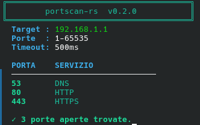

# portscan-rs 🔍

A fast, concurrent TCP port scanner written in Rust.

## Features

- ⚡ Fully async and concurrent via `tokio`
- 🎨 Colored terminal output
- 📊 Real-time progress bar
- 🔍 Known service detection (HTTP, SSH, MySQL, PostgreSQL, and more)
- 🎯 Custom port ranges

## Installation

```bash
git clone https://github.com/AngeloRusu24/portscan-rs
cd portscan-rs
cargo build --release
```

## Usage

```bash
# Scan all ports
./target/release/portscan-rs 192.168.1.1

# Scan a specific port range
./target/release/portscan-rs 192.168.1.1 1 1024
```

## Example Output

╔══════════════════════════════════════╗
║        portscan-rs  v0.2.0           ║
╚══════════════════════════════════════╝
Target : 192.168.1.1
Porte  : 1-65535
Timeout: 500ms
PORTA    SERVIZIO
──────────────────────────────
53       DNS
80       HTTP
443      HTTPS
✓ 3 porte aperte trovate.

## Tech Stack

- [Rust](https://www.rust-lang.org/)
- [tokio](https://tokio.rs/) — async runtime
- [colored](https://crates.io/crates/colored) — terminal colors
- [indicatif](https://crates.io/crates/indicatif) — progress bars

## License

MIT

## Example Output

